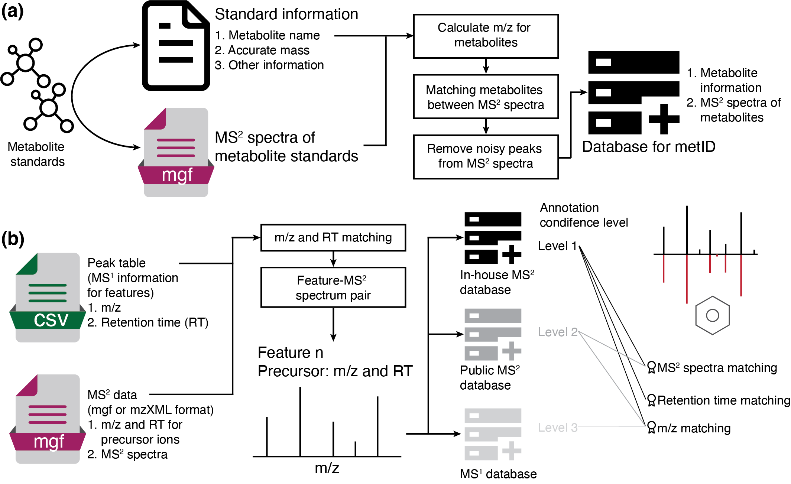

```{r, include=FALSE}
knitr::opts_chunk$set(
  collapse = TRUE,
  comment = "#>",
  out.width = "100%"
)
```

***

## **Introduction & Installation**
******************************************

*metID* is a R package which can be used for in-hosue MS2 database construction, and metabolite identification based on in-house and public MS1 and MS2 database.



Please install it via [github](https://github.com/jaspershen/metID).

```{r,eval=FALSE,warning=FALSE, R.options=""}
if(!require(devtools)){
  install.packages("devtools")
}
devtools::install_github("jaspershen/metID")
```

All the demo data for `metID` are from `demoData`, so please install it first.

```{r,eval=FALSE,warning=FALSE, R.options=""}
devtools::install_github("jaspershen/demoData")
```

`metID` is a part of `tidymass`, so you can also install it by installing [`tidymass`](https://jaspershen.github.io/tidymass/index.html).

## **Database construction**
******************************************

Please refer to this article: [Construct in-house MS2 datbase using metID](https://jaspershen.github.io/metID/articles/database_construction.html) for database construction.

## **Public databases**

We have provide some public databases and our in-house databases, so if you want to use them, please refer this article, [Database provided for `metID`](https://jaspershen.github.io/metID/articles/public_databases.html).

## **Metabolite identification**

If you want to identify metablite without MS2 spectra, please refer to this article, [Annotate metabolites according to MS1 database using metID](https://jaspershen.github.io/metID/articles/metabolite_annotation_using_MS1.html). If you want to identify metabolite with MS2 spectra, please refer to this article, [Annotate metabolites according to MS2 database using metID](https://jaspershen.github.io/metID/articles/metabolite_annotation_using_MS2.html). If you want to identify a peak table with mutiple databases, please refer to this article, [Identify peak tables with multiple databases](https://jaspershen.github.io/metID/articles/multiple_databases.html). If you just want to identify single peak, please refer to this article: [Identify single peak with metID](https://jaspershen.github.io/metID/articles/identify_single_peak.html).


## **Other tools**

`metID` package also has some usefull tools, please refer to this article, [Other tools in metID](https://jaspershen.github.io/metID/articles/other_tools.html)

